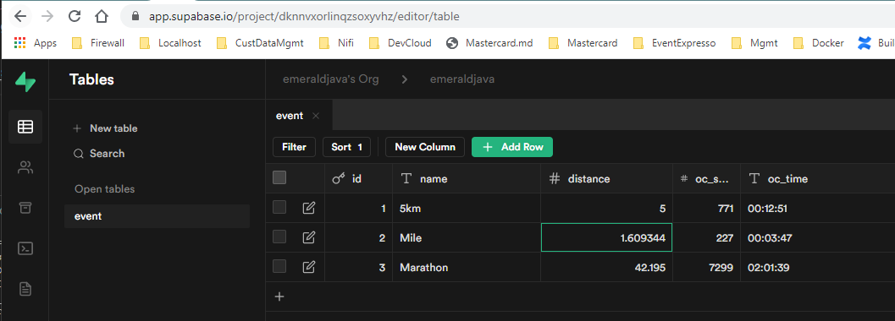

Started looking [supabase.io](https://supabase.io) to get access to a Postgres DB as a service and play with their javascript UI client.

|  |
| ------ |

See https://github.com/AlanLyttonJones/Age-Grade-Tables

## Carbon

See carbon.now.sh

blob:https://carbon.now.sh/72027f28-1ae5-48c5-ba73-cb130ceca298