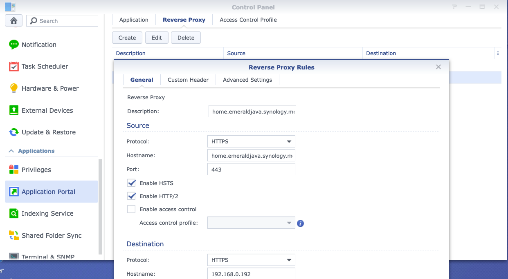
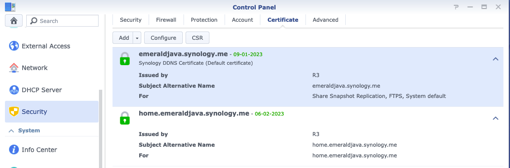

<!-- @import "[TOC]" {cmd="toc" depthFrom=1 depthTo=6 orderedList=false} -->

<!-- code_chunk_output -->

- [Overview](#overview)
- [Test Urls](#test-urls)
- [Synology Config](#synology-config)
  - [external-access-ddns-settings](#external-access-ddns-settings)
  - [application-portal-reverse-proxy-settings](#application-portal-reverse-proxy-settings)
  - [security-certs-settings](#security-certs-settings)

<!-- /code_chunk_output -->

# Overview

The following outline the steps i've taken to try and configure remote access to my synology home assistent instance.

Reference
- https://www.protoncek.com/2021/04/17/synology-reverse-proxy/
- https://community.home-assistant.io/t/setup-on-synology-nas-with-remote-access/430949/2

# Test Urls

The hope is that these URL will return a valid response

    [emeraldjava.synology.me](https://emeraldjava.synology.me)
    [home.emeraldjava.synology.me](https://home.emeraldjava.synology.me)

# Synology Config

This section outlines the specific synology settings that have to align.

## external-access-ddns-settings

This maps the 'domain' to the dynamic IP of my local synology server.

## application-portal-reverse-proxy-settings

Setup a reverse proxy which listens for the specific 'domain' and maps those requests to the process on my synology box.

## security-certs-settings

The config of the SSL cert for each 'domain'.

