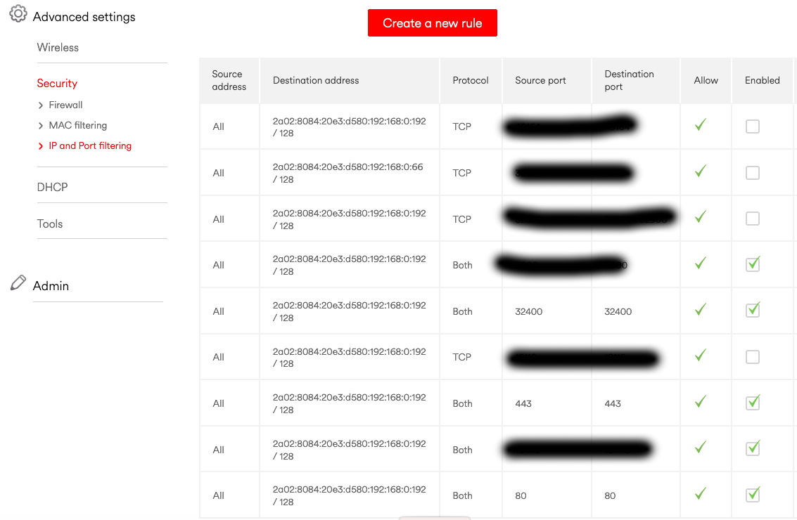
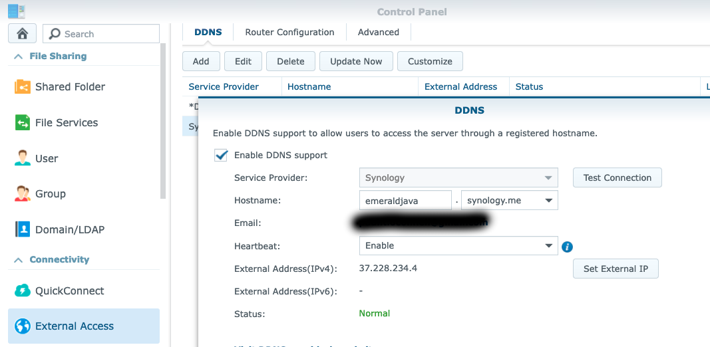
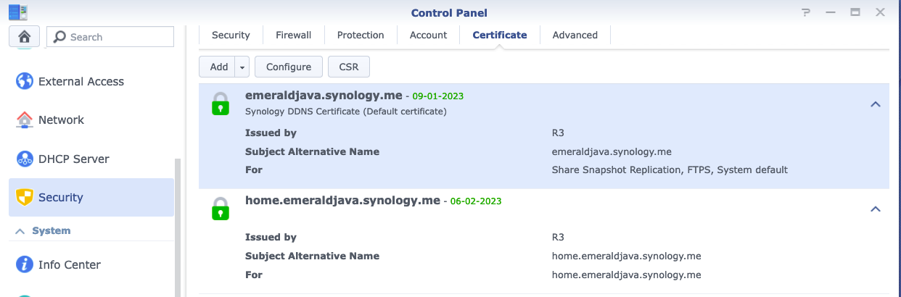

<!-- @import "[TOC]" {cmd="toc" depthFrom=1 depthTo=6 orderedList=false} -->

<!-- code_chunk_output -->

- [Overview](#overview)
- [Test Urls](#test-urls)
- [Router Config](#router-config)
- [Synology Config](#synology-config)
  - [External Access \> DDNS Settings](#external-access--ddns-settings)
  - [Application Portal \> Reverse Proxy](#application-portal--reverse-proxy)
  - [Security \> Certificates](#security--certificates)

<!-- /code_chunk_output -->

# Overview

The following outline the steps i've taken to try and configure remote access to my synology home assistent instance.

<!--more-->

Reference
- https://www.protoncek.com/2021/04/17/synology-reverse-proxy/
- https://community.home-assistant.io/t/setup-on-synology-nas-with-remote-access/430949/2

# Test Urls

The hope is that these URL will return a valid response

[https://emeraldjava.synology.me](https://emeraldjava.synology.me)
[https://home.emeraldjava.synology.me](https://home.emeraldjava.synology.me)

# Router Config

My home router has the following Port Forwarding rules which send all requests to the Synology IP. Ports 443 and 80 should be open. 

I have Plex running via Port 32400 and it's remotely accessible.

# Synology Config

This section outlines the specific synology DS-1512 settings that have to align.

## External Access > DDNS Settings

This maps the 'domain' to the dynamic IP of my local synology server.

## Application Portal > Reverse Proxy

Setup a reverse proxy which listens for the specific 'domain' and maps those requests to the process on my synology box.

## Security > Certificates

The config of the SSL cert for each 'domain'.

The question is which part or parts of the config are incorrect?
