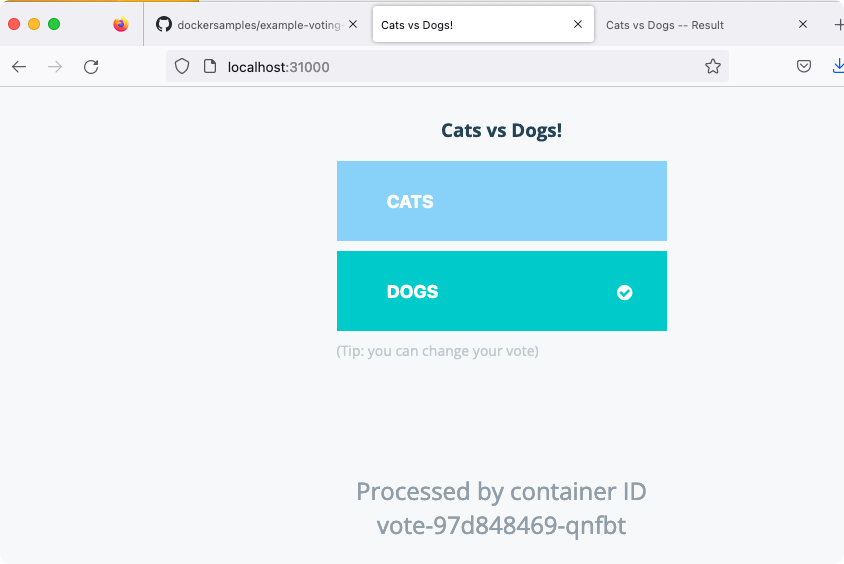
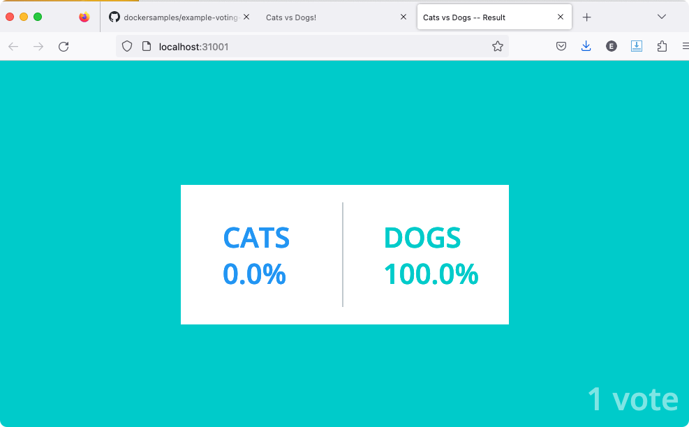

+++
title = "Kubernetes on Docker Desktop starter"
date = 2023-04-08T18:22:26+01:00
author = ""
keywords = ["kubernetes", "docker"]
cover = ""
summary = "Setting up a basic pod via Docker Desktop on Mac"
+++

Via https://github.com/dockersamples/example-voting-app

Running

    ❯ kubectl get nodes

Returns

    NAME             STATUS   ROLES           AGE    VERSION
    docker-desktop   Ready    control-plane   154d   v1.25.2

Clone the 'example-voting' app locally with

    git clone https://github.com/dockersamples/example-voting-app.git

then run

    kubectl create -f k8s-specifications
    kubectl delete -f k8s-specifications

the frontend components should be available at

- vote app: http://localhost:31000

- results app: http://localhost:31001

## Kubernetes Dashboard

via https://andrewlock.net/running-kubernetes-and-the-dashboard-with-docker-desktop/

Running

    kubectl get pods -n kube-system

add the UI

    kubectl apply -f https://raw.githubusercontent.com/kubernetes/dashboard/v2.2.0/aio/deploy/recommended.yaml

