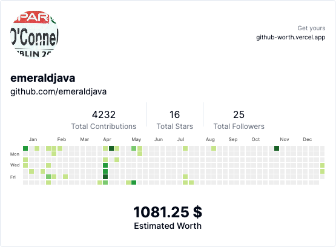

+++
title = "Github Worth"
date = 2023-07-22T20:03:04+01:00
author = "emeraldjava"
keywords = ["github"]
cover = ""
summary = "The percieved value of my github repo!"
+++

Using https://github-worth.vercel.app/ to determine the value of my github repo, it's $1081.25

