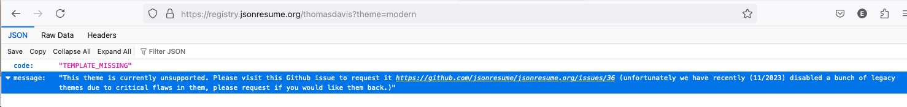

Need a theme which meets these criteria

https://github.com/jsonresume/jsonresume.org/issues/36

Error

https://registry.jsonresume.org/thomasdavis?theme=modern

Works

https://registry.jsonresume.org/thomasdavis?theme=onepage-plus

https://github.com/vkcelik/jsonresume-theme-onepage-plus

https://registry.jsonresume.org/thomasdavis?theme=engineering

use handlebar template

https://stackoverflow.com/questions/24736938/is-it-possible-to-assign-a-parameter-value-within-handlebars-templates-without-u
https://stackoverflow.com/questions/11523331/passing-variables-through-handlebars-partial
https://docs.conscia.ai/solutions/dx-engine/recipes/handlebars-templates