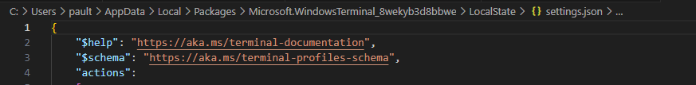

## My Oh Posh

- https://www.hanselman.com/blog/my-ultimate-powershell-prompt-with-oh-my-posh-and-the-windows-terminal
- https://www.hanselman.com/blog/how-to-make-a-pretty-prompt-in-windows-terminal-with-powerline-nerd-fonts-cascadia-code-wsl-and-ohmyposh
- https://www.hanselman.com/blog/now-is-the-time-to-make-a-fresh-new-windows-terminal-profilesjson

- https://whoisryosuke.com/blog/2022/leveling-up-windows-powershell-with-oh-my-posh

  PS C:\Users\pault\github\emeraldjava.github.io> echo $PROFILE
  C:\Users\pault\Documents\WindowsPowerShell\Microsoft.VSCode_profile.ps1

     ~\github\emeraldjava.github.io    astro ≡  ?1 ~1   23.3.0   ERROR  09:23:34  ─╮
  ╰─ New-Item -Path $PROFILE -Type File -Force ─╯

        Directory: C:\Users\pault\Documents\WindowsPowerShell

  Mode LastWriteTime Length Name

  ***

  -a---- 08/12/2024 09:23 0 Microsoft.PowerShell_profile.ps1

╭─    ~\github\emeraldjava.github.io    astro ≡  ?1 ~1   23.3.0     09:25:57  ─╮
╰─ oh-my-posh font install ─╯

    Successfully installed CascadiaCode-2407.24 🚀

    The following font families are now available for configuration:
      • Cascadia Mono NF
      • Cascadia Mono
      • Cascadia Mono PL
      • Cascadia Code
      • Cascadia Code PL
      • Cascadia Code NF

    CascadiaMonoNF

## settings.json file location

https://superuser.com/questions/1817570/where-is-windows-terminal-setting-location-json-file-in-windows-10

%LOCALAPPDATA%\Packages\Microsoft.WindowsTerminal_8wekyb3d8bbwe\LocalState\settings.json

## Docker
